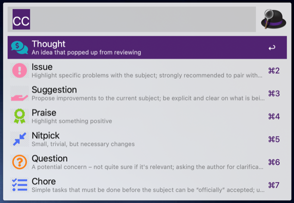

# Conventional Comments Helper

[Conventional comments](https://conventionalcomments.org) are a way to label code review comments to be more helpful. This is an Alfred workflow that aids in creating a comment.

After installing the workflow, activate Alfred, type `cc`, and select the label from the menu.

[Demo video](video/demo.mp4)
